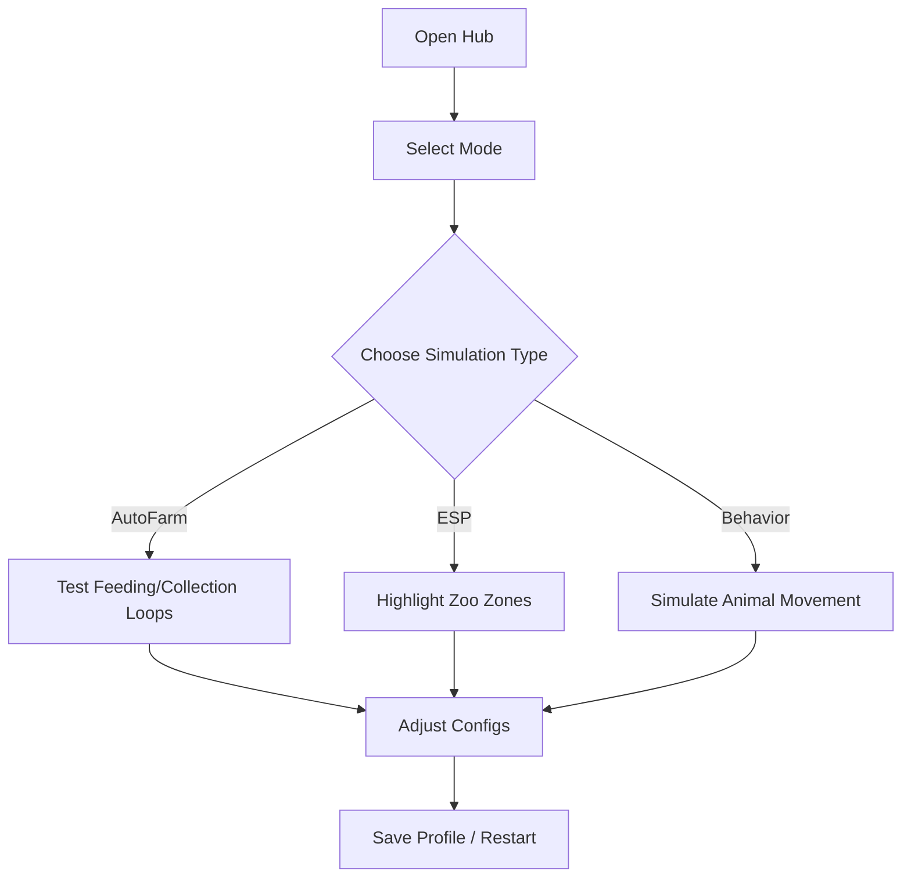

# 🦁 Build a Zoo Script Hub

Welcome to the **Build a Zoo Script Hub**, your new digital habitat for imagination, testing, and design.

Made for developers, creators, and builders, this hub lets you *analyze*, *simulate*, and *perfect* your zoo systems — from automated feeding loops to enclosure layout visualization. Whether you’re building animal habitats, testing resource systems, or recording cinematic overviews, this hub turns your *Build a Zoo* sessions into a creative workshop.

Forget messy scripts or unsafe methods — this is structured, compliant, and built purely for **Studio and private testing**.

---

## 🌿 Overview

The **Build a Zoo Script Hub** is a versatile developer suite that gives you total control over automation and visual analysis in your zoo simulation environment.

It features a polished, keyless interface that lets you test loops, visualize zones, and simulate resource behaviors with precision. Perfect for **builders**, **game designers**, or **Studio creators** refining their tycoon and simulation projects.

Think of it as your **Zoo Manager’s Control Panel** — elegant, stable, and endlessly creative.

[!IMPORTANT]

> This tool is strictly for testing, development, and accessibility research — not for public server play.

---

## ⚙️ Core Features

### 🐘 Automation & Simulation Systems

* **AutoFarm Simulation:** Test food delivery or cleaning loops for logical balance.
* **Auto Collect:** Visualize resource pickup systems without using real data.
* **Staff Path Preview:** Simulate worker movement routes for efficiency mapping.
* **Anti-AFK (UI-based):** Keeps Studio or local testing sessions active.

### 🌍 ESP & Visual Debug Tools

* **ESP Enclosure Zones:** Highlights fences, habitats, and visitor paths.
* **Animal Radar:** Shows entity positions for AI path testing.
* **Item Overlay:** Labels food stations, gates, or utilities for visual reference.
* **Cinematic Camera Mode:** Record or orbit around enclosures for media previews.

### ⚔️ Logic & Behavior Testing

* **Feeding Loop Visualization:** Preview timing cycles for automated feeding systems.
* **Visitor Flow Chart:** Displays visitor density and route preference zones.
* **AI Movement Debug:** Track animal pathfinding behavior in real-time.

### 🎨 UI & Customization

* **Keyless Start:** Instant, activation-free loading.
* **Profile Saving:** Store and reload your best testing setups.
* **Theme System:** Choose from Nature, Steel, or Midnight UI themes.
* **Lightweight Core:** Minimal performance impact — ideal for larger maps.

[!NOTE]

> All data and visuals are **simulated**; no real game mechanics are altered or affected.

---

## 🚀 Quick Setup

1. Launch **Roblox Studio** or your **private testing server**.
2. Load the **Build a Zoo Script Hub** module.
3. Select your testing mode — *AutoFarm*, *ESP*, or *Behavior*.
4. Adjust simulation sliders (delay, range, speed).
5. Save your configuration profile and start your testing session.

And that’s it — your personal zoo testing control panel is live.

---

### 🧭 Hub Flow (Mermaid)

---

## ❓ FAQ

**Q: Can this run in live Build a Zoo servers?**
A: No — it’s built strictly for Studio and private test environments.

**Q: Is it free to use?**
A: Yes! It’s fully free and **keyless** — no activation codes needed.

**Q: What does AutoFarm do in this hub?**
A: It’s a *logic simulator* that mimics feeding or resource loops to test automation, not an exploit or live farming tool.

**Q: Can I record cinematics or previews?**
A: Absolutely — the hub includes camera orbit and smooth tracking for cinematic recording.

**Q: Does it support accessibility tools?**
A: Yes — high contrast modes, scalable fonts, and color-coded overlays are included.

---

## 🌳 Why Developers Love It

Because the **Build a Zoo Script Hub** is built with developers in mind — not exploiters.

It helps you visualize systems, detect timing errors, and improve gameplay flow while keeping everything ethical and contained.

* **Zero lag** even in large maps.
* **Clear debugging overlays** for enclosures and NPCs.
* **Instant restart & recovery** after Studio reloads.
* **Modern interface** that’s both intuitive and gorgeous.

> Whether you’re testing animal AI, optimizing park layouts, or creating cinematic trailers — this hub keeps your work flowing like a well-run zoo.

---

## 🔍 SEO Keywords

build a zoo script, build a zoo script hub, build a zoo autofarm, build a zoo esp, build a zoo automation tool, roblox build a zoo hub, build a zoo sandbox, build a zoo cinematic ui, build a zoo developer testing, build a zoo visual debug

---

## 🦓 Final Thoughts

The **Build a Zoo Script Hub** isn’t just another testing utility — it’s a *creative partner*.
From enclosure logic to cinematic flyovers, it transforms the act of testing into an art form.

So go ahead — run your loops, preview your systems, and make your zoo thrive.

Because every great zoo starts with a great plan.

